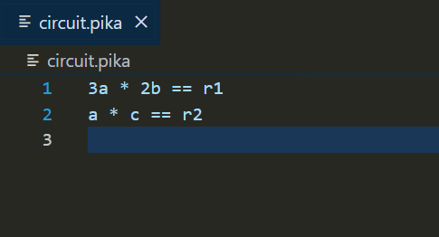
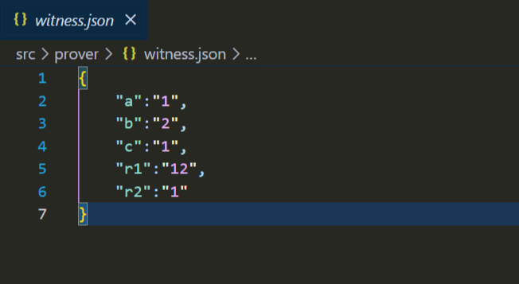

# Pikachu


## Description
Smol SNARK based on (Why and How Zksnark works) : https://arxiv.org/abs/1906.07221. Only supports mul and non negative constraints. *Not suitable for production use*.

## Table of Contents
- [Installation](#installation)
- [Usage](#usage)
- [Improvements](#improvements)

## Installation
Ensure you have [Rust](https://www.rust-lang.org/tools/install) and [Cargo](https://doc.rust-lang.org/cargo/) installed. To install the project, run:
```bash
git clone https://github.com/Saksham010/Pikachu
cd Pikachu
cargo build 
```

## Usage

### Trusted setup
Specify your constraint/circuit for computation in circuit.pika file in root folder. *Only supports multiplicative constraint as of now* Eg:



Run trusted setup to generate proving and verification key. *Doesn't support adding randomness*:
```bash
cargo run -- trusted-setup
```
Two binary files *proving_key.bin* and *verification_key.bin* will be generated in the root directory

### Proof Generation
Honest prover will provide valid constraint/circuit for computation in prover/prover_polynomial.pika file that matches to that of the agreed circuit during trusted setup. In prover/witness.json provide all the values for involved variable in the circuit and their computed values. Eg:



*Proof generated form the values that does not satisfy the constraint is rejected*

Generate proof by running:
```bash
cargo run -- prover
```
Copy the proof string.

### Proof Verification
Honest verifier will run the recieved proof with the verifier algorithm.
```bash
cargo run -- verifer REPLACE_WITH_PROOF
```
The verification algorithm will output whether the proof is valid or not in the console.

## Improvements
- [ ] Contribute randomess in the setup ceremony
- [ ] Support for add,sub,div constraints
